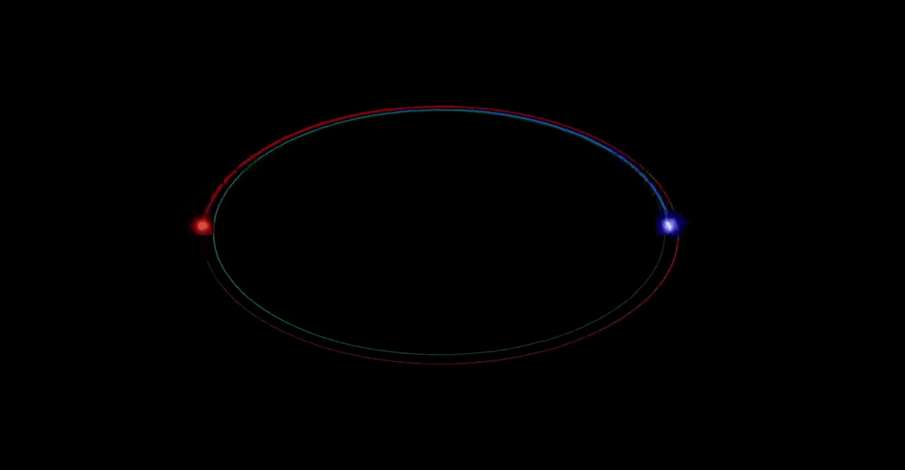

# About Cerns Open Data Portal

 The CERN Open Data portal is the access point to a growing range of data produced through the research performed at CERN. It disseminates the preserved output from various research activities, including accompanying software and documentation which is needed to understand and analyse the data being shared.

The portal adheres to established global standards in data preservation and Open Science: the products are shared under open licenses; they are issued with a digital object identifier \(DOI\) to make them citable objects in the scientific discourse \(see details below on how to do this\). 

For more information go to [http://opendata.cern.ch/docs/about](http://opendata.cern.ch/docs/about)

