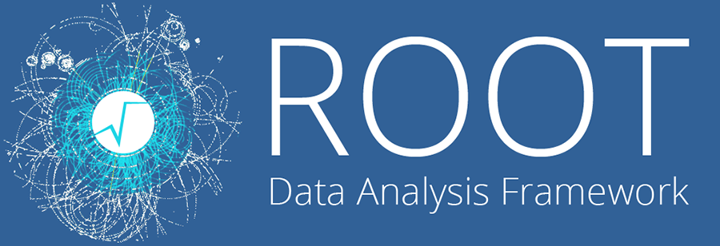

# An introduction to ROOT



CERN data is not easy to look at and analyze. The data files are in this format called Analysis Object Data or AOD for short. This is where the virtual machine and ROOT comes in handy. The virtual machine will stream the data while ROOT can allow for us to view the data. Without both the virtual machine and ROOT there would be no way of viewing the data files. Lets walkthrough how to use ROOT to view the data files!


The following code is linux. If you are unfamiliar with this code then we recommend taking a short and free interactive course to learn it fast. Here is a link to the course:

 [https://www.codecademy.com/learn/learn-the-command-line](https://www.codecademy.com/learn/learn-the-command-line)


#### Step 1: Lets make a datasets directory!

           Enter the following commands into your terminal to get started

```bash
$ cmsrel CMSSW_5_3_32 #This ensures you have the version of CMSSW running
$ cd CMSSW_5_3_32/src/ #This changes your directory to the source file
$ cmsenv #This makes sure you have a CMS environment
$ mkdir Demo #This makes a Demo directory
$ cd Demo #Navigates into the Demo Directory
$ mkedanlzr DemoAnalyzer #This makes an analyzer script
$ scram b #This will compile the files
$ mkdir datasets #This makes your dataset directory
```

#### Step 2: Find and store data on your Virtual Machine

1. Launch and run cernVM
2. On the home page or the Applications Menu you will find the option to open a browser in the Virtual Machine, click on the browser icon and launch a browser
3. Once the browser is launched go to Cerns Open Data Portal at the link  [http://opendata.cern.ch/](http://opendata.cern.ch/) or by simply looking it up
4. At the bottom of the page click on "datasets"
5. Find your desired dataset
6. DO NOT directly download the dataset instead hit "save to files". Save this to your dataset directory. 

#### Step 3: In order to root a file you need the file link on the virtual machine. We can do this accessing the data files you downloaded to the virtual machine.

1. Navigate to your datasets directory
2. once in your datasets directory type:

```bash
$ ls #This will list everything withtin that directory
```

    3. You should see the data files you downloaded from earlier. Highlight and copy one of the datasets \(Shift+ctrl+c\). Then enter this into your terminal to view the file:

```bash
$ less ***paste your file here(shift+ctrl+v)*** 
```

    4. You should have a lot of root files pop up on your monitor. Copy one of the root files \(shift+ctrl+c\). Then exit the file by hitting shift+z+z on your keyboard.

    5. Once you return to your bash terminal. Enter this into your terminal: 

```text
$ root ***paste your file here(shift+ctrl+v)*** 
```

    6. This will then launch ROOT.  Now you can enter this into your terminal to view the data: 

```text
$ TBrowser t;
```

    7. Once the window opens up, go into the root folder by double clicking. This will then display the different types of data collected.


Congratulations your viewed your first ROOT file! Remember you can do this with any desired dataset.


