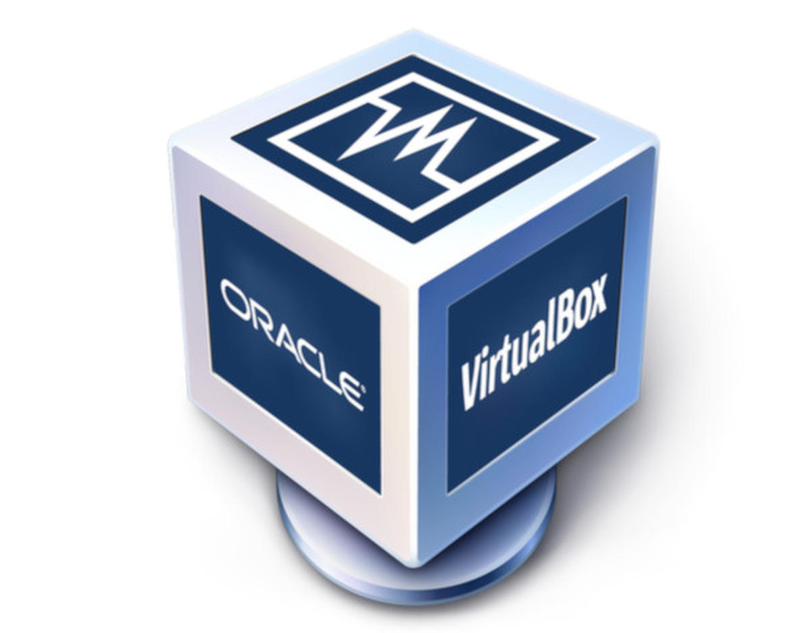

# Let's Get Started!

###                                       Virtual box Installation  

##                         

To begin looking at CERN's Open Data Portal, we must first download virtual box. This is a virtual machine that would allow your computer to run a different operating system thus allowing you to access and stream CERN's data. 

1. To download Virtual box for your operating system, click on the link:   [https://www.virtualbox.org/wiki/Download\_Old\_Builds\_5\_2](https://www.virtualbox.org/wiki/Download_Old_Builds_5_2)


Make sure you download Virtual Box version 5.2.3 


### Installing Virtual Box


Windows: 



Mac OS: 


### chnge

* Animals are now super cute, all of t

## 14.0.0 - 2042-10-06

### Added

* Introduced animals into the world, we believe they're going to be a neat addition.

